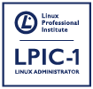

# LPIC-1

Guia de estudio de preparacion para la certificación LPIC-1.

LPIC son las siglas de **Linux Professional Institute Certification**.

A fecha de 03/04/2019 esta certificación se encuentra en la versión 5.0 y los códigos de examen son 101-500 y 102-500. El examen no esta disponible en idioma español, aunque la version 4.0 esta disponible hasta Julio de 2019.

Se divide en dos exámenes: :+1:

- Examen 101
- Examen 102

## Objetivos del examen 101

- [ ] [Tema 101: Arquitectura del Sistema](docs/101-500/Tema_101.md)
- [ ] [Tema 102: Instalación de Linux y gestión de paquetes](docs/101-500/Tema_102.md)
- [ ] [Tema 103: Comandos GNU y Unix](docs/101-500/Tema_103.md)
- [ ] [Tema 104: Dispositivos, sistemas de archivos Linux y el estándar de jerarquía de archivos](docs/101-500/Tema_103.md)

## Objetivos del examen 102

- [ ] [Tema 105: Shells y scripts](docs/102-500/Tema_105.md)
- [ ] [Tema 106: Interfaces de usuario y escritorios](docs/102-500/Tema_106.md)
- [ ] [Tema 107: Tareas administrativas](docs/102-500/Tema_106.md)
- [ ] [Tema 108: Servicios esenciales del sistema](docs/102-500/Tema_107.md)
- [ ] [Tema 109: Fundamentos de redes](docs/102-500/Tema_108.md)
- [ ] [Tema 110: Seguridad](docs/102-500/Tema_109.md)

Al obtener esta certificación se obtiene los conocimientos necesarios para:

- Comprender la arquitectura de un sistema Linux.
- Instalar y mantener una estación de trabajo Linux, incluyendo X11 y  su configuración como un cliente de red.
- Trabajar en la línea de comandos de Linux, incluidos los comandos comunes de GNU y Unix.
- Manejar archivos y permisos de acceso, así como la seguridad del sistema.
- Realizar tareas de mantenimiento sencillas: ayudar a los usuarios, agregar usuarios a un sistema más grande, realizar copias de seguridad y restaurar, apagar y reiniciar.

Al obtener esta cerfificación se garantiza que has adquirido unos conocimientos suficientes para resolver los problemas más comunes con los que te puedes encontrar cuando trabajas con sistemas UNIX.

## FAQ

### Preguntas para resolver sobre la certificación

¿El examen se puede realizar en español?

¿Dónde se hace el examen?¿Presencial o online?

¿Qué precio tiene el examen?

## Enlaces

[Wiki con los objetivos de la version 5.0](https://wiki.lpi.org/wiki/LPIC-1_Objectives_V5.0(ES))

[Wiki del contenido en github](https://github.com/appijumbo/Linux-LPIC-1/wiki)

[Materiales de estudio en español](http://www.lpifit.com/course/)

[Consola de linux Online](https://www.tutorialspoint.com/unix_terminal_online.php)

### Documentacion oficial Linux

[The Linux Document Proyect](http://www.tldp.org/)

[GNU Proyect](http://www.gnu.org/doc/)

[Man pages](https://linux.die.net/man/) 

[Free Software Directory](https://directory.fsf.org/wiki/Main_Page)

### Blog's

[Blog de contenido Linux](http://www.linuxlinks.com)

### Videos

[Lista de reproducción de youtube LPIC-1](https://www.youtube.com/watch?v=Fov9nM-AbSw&list=PLD_mb6U5Xp95cX_CDO3Cg-p8370lPwRR2)

[The Linux man](https://www.youtube.com/channel/UCVQ7kPpJJ2FA_iYl8Wtx0SA)

### Canales de ayuda

[Freenode](https://webchat.freenode.net)

[Buscador de canales IRC](http://irc.netsplit.de/channels/)

[Canal Freenode para principiantes](http://irc2go.com/webchat/?net=freenode&room=%23linux-beginners)

[1]: contenido.md
